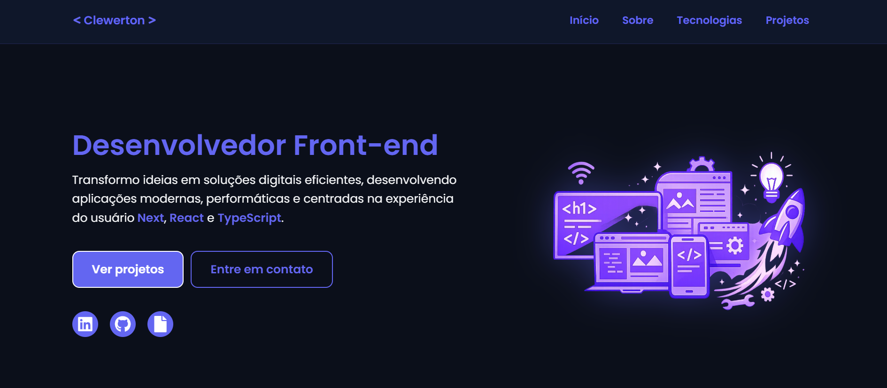

# 🧑‍💻 Portfólio Dev

Aplicação de portfólio desenvolvida para apresentar meus projetos, habilidades e informações profissionais de forma moderna, responsiva e interativa.

O projeto foi construído com Next.js, explorando Server Components e Client Components, garantindo performance e uma boa experiência de usuário.

Os dados são gerenciados via Cosmic CMS, permitindo fácil atualização de conteúdos como projetos e seção "Sobre", sem necessidade de alterar o código.

Além disso, conta com um formulário de contato funcional utilizando EmailJS, com validação robusta feita com React Hook Form e Zod.

---

## 🚀 Tecnologias Utilizadas

- ⚛️ Next.js
- 🔷 TypeScript
- 🎨 Tailwind CSS
- 🌐 Cosmic CMS
- 📩 EmailJS
- 📋 React Hook Form
- ✅ Zod
- 🎞️ AOS (Animate On Scroll)

---

## 📌 Funcionalidades

✔️ Consumo de dados dinâmicos via CMS (Cosmic)
✔️ Atualização de conteúdo sem deploy
✔️ Detecção de seção ativa na navegação (scroll spy)
✔️ Animações suaves ao scroll com AOS
✔️ Formulário de contato funcional
✔️ Validação de formulário com Zod
✔️ Interface responsiva e moderna

---

## 📸 Preview

---

## 🌎 Deploy

Acesse o projeto online:

👉 https://portfolio-clewerton.vercel.app

---

## 💡 Aprendizados

- Arquitetura com Next.js (Server e Client Components)
- Tipagem avançada com TypeScript
- Integração com CMS (Cosmic)
- Manipulação e validação de formulários
- Experiência do usuário (UX/UI)
- Organização e escalabilidade de código